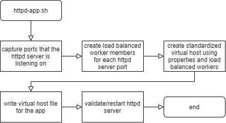

# Node.js Installation
The scripts provided in this directory can be used to agnostically build, install, test and deploy [Node.js](https://nodejs.org) applications using `bash`.

The script utilizes [nvm (Node Version Management)](https://github.com/nvm-sh/nvm) so each application can define it's own `.nvmrc` file that contains the version of Node.js that should be used to build, deploy and run the app. The [`nvmrc.sh`](nvmrc.sh) script is internally called by [`node-app.sh`](node-app.sh) and will ensure that the Node.js version defined within the `.nvmrc` file is installed and used during builds and deployments as well as the version used for the running app. The `.nvmrc` file can also contain a [Node.js codename](https://github.com/nodejs/Release/blob/master/CODENAMES.md). In which case, the latest derived Node.js version for the defined codename will be installed and used during builds and deployments as well as the version used for the running app.

## TOC
- [Build Flow](#nodeAppBuild)
- [Deply Flow](#nodeAppDeploy)
- [HTTP/S Server Flow](#httpdApp) [(`httpd-app.sh`)](httpd-app.sh)
- [Node.js Install Script](#nodeInstall) [(`nvmrc.sh`)](nvmrc.sh)
- [Build/Deploy Script](#nodeApp) [(`node-app.sh`)](node-app.sh)
- [Example Build](#exampleBuild)
- [Example Deploy](#exampleDeploy)
- [Example Bamboo](#exampleBamboo)

## Build <a name="nodeAppBuild"></a>
The following steps are performed by [`node-app.sh`](node-app.sh) for a `BUILD` (for clarity, error handling is excluded from diagram):

<kbd></kbd>

## Deployment <a name="nodeAppDeploy"></a>
The following steps are performed by [`node-app.sh`](node-app.sh) for a `DEPLOY*` (for clarity, error handling is excluded from diagram):

<kbd></kbd>

## Node.js Install (from `.nvmrc` file) <a name="nodeInstall"></a>
Internally, [`node-app.sh`](node-app.sh) calls [`nvmrc.sh`](nvmrc.sh) (as seen in the previous diagrams). The following steps are performed by [`nvmrc.sh`](nvmrc.sh) (for clarity, error handling is excluded from diagram):

<kbd></kbd>

## HTTP/S Server <a name="httpdApp"></a>
The [`httpd-app.sh`](httpd-app.sh) can be used independently of any Node.js specific app installation. When invoked by [`node-app.sh`](node-app.sh) will utilize the same `.properties` file used by [`httpd-app.sh` (click for default/available properties)](httpd-app.sh).

<kbd></kbd>

## Build/Deploy Script <a name="nodeApp"></a>
The [`node-app.sh`](node-app.sh) should be executed using the following paramters:

- __Execution type__ - either `BUILD`, `DEPLOY` or `DEPLOY_CLEAN`
- __The application's name__ - will be used for generated artifact names, systemd services, etc. (must contain only alpha characters)
- __NODE_ENV__ - the environmental veriable that will be set when running the Node.js app
- __Dir path for artifacts__ - for build, this will be where the built/compressed archive will be placed as well as the copied configuration properties file. for deployments, this is where the built atifact/archive and the copied configuration properties will be read from (each will be named `<APP_NAME>.tar.gz` and `<APP_NAME>.properties`, respectively)

Examples:

```sh
# Build the app using the specified artifacts dest dir
node-app.sh BUILD myAppName development "./artifacts"
# Deploy the app using the specified artifacts source dir
node-app.sh DEPLOY myAppName test "/tmp"
# Clean the app and corresponding systemd services
# and redeploy the app using the specified artifacts
# source dir
node-app.sh DEPLOY_CLEAN myAppName production "/tmp"
```

Each application should contain a `node-app.properties` file in the _root_ directory fo the application. Properties contained in the file define different options that will be used for the build and deployment processes. The configuration `.proerties` file can contain the following properties:

```sh
################################################
# Properties used by the node-app.sh script for
# building/deploying the Node.js app services
# ----------------------------------------------
# NOTE: during BUILD the generated artifact
# resides at
# ${app.directory}/artifacts/${app.name}.gz.tar
# ----------------------------------------------
# NOTE: during DEPLOY the generated BUILD
# artifact is expected to reside at
# ${temp.directory}/${app.name}/${app.name}.gz.tar
# ----------------------------------------------

################################################
# Application specific properties
# ==============================================
# The app description for systemd service, etc.
# ==============================================
app.description=${PASSED_APP_NAME}
# ==============================================
# The app description for systemd service, etc.
# ----------------------------------------------
# >>> REQUIRED
# ==============================================
app.BUILD.directory=${PWD}
app.DEPLOY.directory=
app.DEPLOY_CLEAN.directory=
# ==============================================
# The app port number for systemd service, etc.
# ==============================================
app.port.number=
# ==============================================
# When the ${app.port.number} is defined, the
# count will determine how to vertically scale
# the node app instances/systemd services.
# ----------------------------------------------
# >>> DEFAULT: the number of CPU cores on the
# target deployment machine or blank when a port
# number is not specified
# ----------------------------------------------
# For example, a port number of 9001 and a count
# of 4 would result in 4 services at ports 9001,
# 9002, 9003 and 9004 
# ==============================================
app.port.count=${CAL_CPU_COUNT}
# ==============================================
# The directory where the app target/services
# will be written
# ==============================================
app.systemd.directory=/etc/systemd/system
################################################

################################################
# Comands will be executed directly to shell.
# Order of execution of commands:
# BUILD:
# 1. install
# 2. test (unit testing)
# 3. bundle
# DEPLOY:
# 1. debundle
# 2. install
# 3. traget service start
# 4. test (integration testing)
# ==============================================
# The command that will install the app.
# typically, this will be "npm ci" or "npm 
# install".
# ==============================================
app.command.BUILD.install=npm ci
app.command.DEPLOY.install=npm install
app.command.DEPLOY_CLEAN.install=npm install
# ==============================================
# The command that will run any tests performed
# on the app (if any)
# ==============================================
app.command.BUILD.test=
app.command.DEPLOY.test=
app.command.DEPLOY_CLEAN.test=
# ==============================================
# The command that will perform any bundling
# required by the app during a build (if any)
# ==============================================
app.command.BUILD.bundle=
# ==============================================
# The command that will perform any debundling
# required by the app during deployment (if any)
# ==============================================
app.command.DEPLOY.debundle=
app.command.DEPLOY_CLEAN.debundle=
################################################

################################################
# HTTP server properties for httpd-app.sh
# ==============================================
# The HTTP server type to use (omit for none).
# The type can be one of the following values:
# - apache
# ==============================================
httpd.type=
# ==============================================
# The destination of the app conf that will be
# written to using the app name as the file name
# ==============================================
httpd.app.conf.dir=/etc/httpd/conf.d
# ==============================================
# The context path to the app
# ==============================================
httpd.app.path=/
# ==============================================
# The domain used in the alias, logs, etc.
# When defined, the app name is considered to be
# a 3rd level domain. For example, if the domain
# is "example.com" with an app name of "myapp"
# and a machine name of "myserver01" (when the
# server conttains no numeric value, it will be
# omitted from the entries below):
# ----------------------------------------------
# # assuming httpd.type=apache
# ServerName myapp01.example.com
# ServerAlias myapp myapp01 myapp01.example.com
# ----------------------------------------------
# When the domain is undefined and the app name
# is "myapp":
# ----------------------------------------------
# # assuming httpd.type=apache
# ServerName myapp
# ==============================================
httpd.app.domain=
# ==============================================
# The sticky session identifier that will ensure
# that all subsequent requests from the user
# will be routed through the same route instead
# of being load balanced (e.g. JSESSIONID, etc.)
# ==============================================
httpd.app.stickysession=
# ==============================================
# The load balancing scheduler algorithm to use
# for vertical scaling. See the specific httpd
# server docs for valid values.
# ==============================================
httpd.app.lbmethod=${DEFAULT_FOR_HTTP_SERVER}
# ==============================================
# The directory to the httpd-app.sh script that
# will be ran from node-app.sh (omit to is false)
# ==============================================
httpd.script.directory=${CALLING_SCRIPT_DIR}
################################################

# ==============================================
# The directory to where the nvmrc.sh is located
# Used to install Node.js based upon the .nvmrc
# file located in the root of the app directory
# ==============================================
nvmrc.script.directory=${CALLING_SCRIPT_DIR}

# ==============================================
# The directory to where temporary files will be
# stored
# ==============================================
temp.directory=/tmp
```

## Build Script <a name="exampleBuild"></a>
A simple/portable bash script can be used in the `BUILD` task:

```sh
# run the script that will build, install Node.js from the apps
# .nvmrc version (if needed), tests the app (optional), bundles
# the app (optional, e.g. webpack, snowpack, etc.) and generates
# a single compressed archive artifact (optional)
# NOTE: assumes node-app.properties resides in the root dir of the app
##################################################################################
# $1 Execution type (required: either BUILD, DEPLOY or DEPLOY_CLEAN)
# $2 The app name (required: must contain only alpha characters)
# $3 The NODE_ENV value that will be set when the app is ran (optional: set when app is ran)
# $4 Dir path for artifacts (the archive and conf properties will be placed/extracted to/from)
APP_NAME=myapp
REPO_VER=v0.0.0 # real version here
WRK_DIR=/tmp/$APP_NAME
rm -fr $WRK_DIR && mkdir -p $WRK_DIR
wget -N -O $WRK_DIR/nvmrc.sh https://raw.githubusercontent.com/ugate/repo/$REPO_VER/nodejs/nvmrc.sh
wget -N -O $WRK_DIR/node-app.sh https://raw.githubusercontent.com/ugate/repo/$REPO_VER/nodejs/node-app.sh
chmod +x $WRK_DIR/nvmrc.sh
chmod +x $WRK_DIR/node-app.sh
$WRK_DIR/node-app.sh BUILD $APP_NAME test "./artifacts"
exit $?
```

Using the example above and assuming `./node-app.properties` contains `app.name=myapp`, the `BUILD` task will generate the following artifacts:

- `./artifacts/myapp.tar.gz` (contains the built app contents)
- `./artifacts/myapp.properties` (contains the original `./node-app.properties` that will be needed during deployment)

## Deploy Script <a name="exampleDeploy"></a>
A simple/portable bash script can be used in the `DEPLOY` or `DEPLOY_CLEN` task:

```sh
# run the script that will build, install Node.js from the apps
# .nvmrc version (if needed), tests the app (optional), bundles
# the app (optional, e.g. webpack, snowpack, etc.) and generates
# a single compressed archive artifact (optional)
# NOTE: assumes /tmp/$APP_NAME.tar.gz and /tmp/$APP_NAME.properties files exist
##################################################################################
# $1 Execution type (required: either BUILD, DEPLOY or DEPLOY_CLEAN)
# $2 The app name (required: must contain only alpha characters)
# $3 The NODE_ENV value that will be set when the app is ran (optional: set when app is ran)
# $4 Dir path for artifacts (the archive and conf properties will be placed/extracted to/from)
APP_NAME=myapp
REPO_VER=v0.0.0 # real version here
WRK_DIR=/tmp/$APP_NAME
rm -fr $WRK_DIR && mkdir -p $WRK_DIR
wget -N -O $WRK_DIR/nvmrc.sh https://raw.githubusercontent.com/ugate/repo/$REPO_VER/nodejs/nvmrc.sh
wget -N -O $WRK_DIR/node-app.sh https://raw.githubusercontent.com/ugate/repo/$REPO_VER/nodejs/node-app.sh
chmod +x $WRK_DIR/nvmrc.sh
chmod +x $WRK_DIR/node-app.sh
$WRK_DIR/node-app.sh DEPLOY $APP_NAME test "/tmp"
exit $?
```

## Bamboo <a name="exampleBamboo"></a>
Setting up CICD in Bamboo is fairly simple using the previous [build](#exampleBuild)/[deploy](#exampleDeploy) example tasks following the steps below:

### Build
- Add a __Source Control Checkout__ task for the repository for the app
- Add a __Script Task__ (shell/inline) and use the [build script above](#exampleBuild)
- Add __Artifacts__. Location: `artifacts`, Copy Pattern: `**/*.tar.gz` and Location: `artifacts`, Copy Pattern: `**/*.properties`

### Deploy
- Add a __Artifact download__ task for __Clean working directory task__
- Add an __SCP Task__ to copy the artifacts to the deployment server. Artifacts: `...:all artifacts`, Remote Path: `/tmp`
- Add an __SSH Task__ and copy the [deploy script above](#exampleDeploy) into the __SSH Command__
- Rinse and repeat all steps except the __Artifact download__ for each deployment server