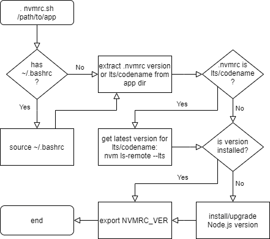

# Node.js Installation
The scripts provided in this directory can be used to agnostically build, install, test and deploy [Node.js](https://nodejs.org) applications using `bash`.

The script utilizes [nvm (Node Version Management)](https://github.com/nvm-sh/nvm) so each application can define it's own `.nvmrc` file that contains the version of Node.js that should be used to build, deploy and run the app. The [`nvmrc.sh`](nvmrc.sh) script is internally called by [`node-app.sh`](node-app.sh) and will ensure that the Node.js version defined within the `.nvmrc` file is installed and used during builds and deployments as well as the version used for the running app. The `.nvmrc` file can also contain a [Node.js codename](https://github.com/nodejs/Release/blob/master/CODENAMES.md). In which case, the latest derived Node.js version for the defined codename will be installed and used during builds and deployments as well as the version used for the running app.

## Build
The following steps are performed by [`node-app.sh`](node-app.sh) for a `BUILD` (for clarity, error handling is excluded from diagram):

<kbd></kbd>

## Deployment
The following steps are performed by [`node-app.sh`](node-app.sh) for a `DEPLOY*` (for clarity, error handling is excluded from diagram):

<kbd></kbd>

## Node.js Install (from `.nvmrc` file)
Internally, [`node-app.sh`](node-app.sh) calls [`nvmrc.sh`](nvmrc.sh) (as seen in the previous diagrams). The following steps are performed by [`nvmrc.sh`](nvmrc.sh) (for clarity, error handling is excluded from diagram):

<kbd></kbd>

## Build/Deploy Script
The [`node-app.sh`](node-app.sh) should be executed using the following paramters:

- __Execution type__ - either `BUILD`, `DEPLOY` or `DEPLOY_CLEAN`
- __The application's name__ - will be used for generated artifact names, systemd services, etc. (must contain only alpha characters)
- __NODE_ENV__ - the environmental veriable that will be set when running the Node.js app
- __Dir path for artifacts__ - for build, this will be where the built/compressed archive will be placed as well as the copied configuration properties file. for deployments, this is where the built atifact/archive and the copied configuration properties will be read from (each will be named `<APP_NAME>.tar.gz` and `<APP_NAME>.properties`, respectively)

Examples:

```sh
# Build the app using the specified artifacts dest dir
node-app.sh BUILD myAppName development "./artifacts"
# Deploy the app using the specified artifacts source dir
node-app.sh DEPLOY myAppName test "/tmp"
# Clean the app and corresponding systemd services
# and redeploy the app using the specified artifacts
# source dir
node-app.sh DEPLOY_CLEAN myAppName production "/tmp"
```

Each application should contain a `node-app.properties` file in the _root_ directory fo the application. Properties contained in the file define different options that will be used for the build and deployment processes. The configuration `.proerties` file can contain the following properties:

```sh
################################################
# Properties used by the node-app.sh script for
# building/deploying the Node.js app services
# ----------------------------------------------
# NOTE: during BUILD the generated artifact
# resides at
# ${app.directory}/artifacts/${app.name}.gz.tar
# ----------------------------------------------
# NOTE: during DEPLOY the generated BUILD
# artifact is expected to reside at
# ${temp.directory}/${app.name}/${app.name}.gz.tar
# ----------------------------------------------

################################################
# Application specific properties
# ==============================================
# The app description for systemd service, etc.
# ----------------------------------------------
# >>> REQUIRED
# ==============================================
app.description=
# ==============================================
# The app description for systemd service, etc.
# ----------------------------------------------
# >>> DEFAULT: for BUILD, $PWD for DEPLOY* ""
# ==============================================
app.BUILD.directory=
app.DEPLOY.directory=
app.DEPLOY_CLEAN.directory=
# ==============================================
# The app port number for systemd service, etc.
# ==============================================
app.port.number=
# ==============================================
# When the ${app.port.number} is defined, the
# count will determine how to vertically scale
# the node app instances/systemd services.
# ----------------------------------------------
# >>> DEFAULT: the number of CPU cores on the
# target deployment machine or blank when a port
# number is not specified
# ----------------------------------------------
# For example, a port number of 9001 and a count
# of 4 would result in 4 services at ports 9001,
# 9002, 9003 and 9004 
# ==============================================
app.port.count=
# ==============================================
# The directory where the app target/services
# will be written
# ----------------------------------------------
# >>> DEFAULT: /etc/systemd/system
# ==============================================
app.systemd.directory=
################################################

################################################
# Comands will be executed directly to shell.
# Order of execution of commands:
# BUILD:
# 1. install
# 2. test (unit testing)
# 3. bundle
# DEPLOY:
# 1. debundle
# 2. install
# 3. traget service start
# 4. test (integration testing)
# ==============================================
# The command that will install the app.
# typically, this will be "npm ci" or "npm 
# install".
# ==============================================
app.command.BUILD.install=npm ci
app.command.DEPLOY.install=npm install
app.command.DEPLOY_CLEAN.install=npm install
# ==============================================
# The command that will run any tests performed
# on the app (if any)
# ==============================================
app.command.BUILD.test=
app.command.DEPLOY.test=
app.command.DEPLOY_CLEAN.test=
# ==============================================
# The command that will perform any bundling
# required by the app during a build (if any)
# ==============================================
app.command.BUILD.bundle=
# ==============================================
# The command that will perform any debundling
# required by the app during deployment (if any)
# ==============================================
app.command.DEPLOY.debundle=
app.command.DEPLOY_CLEAN.debundle=
################################################

# ==============================================
# The directory to where the nvmrc.sh is located
# Used to install Node.js based upon the .nvmrc
# file located in the root of the app directory
# ----------------------------------------------
# >>> DEFAULT: the same path of the calling
# shell script
# ==============================================
nvmrc.script.directory=

# ==============================================
# The directory to where temporary files will be
# stored
# ----------------------------------------------
# >>> REQUIRED
# ==============================================
temp.directory=/tmp
```

## Build Script
A simple/portable bash script can be used in the `BUILD` task:

```sh
# run the script that will build, install Node.js from the apps
# .nvmrc version (if needed), tests the app (optional), bundles
# the app (optional, e.g. webpack, snowpack, etc.) and generates
# a single compressed archive artifact (optional)
# NOTE: assumes node-app.properties resides in the root dir of the app
##################################################################################
# $1 Execution type (required: either BUILD, DEPLOY or DEPLOY_CLEAN)
# $2 The app name (required: must contain only alpha characters)
# $3 The NODE_ENV value that will be set when the app is ran (optional: set when app is ran)
# $4 Dir path for artifacts (the archive and conf properties will be placed/extracted to/from)
APP_NAME=myapp
REPO_VER=v0.0.0 # real version here
WRK_DIR=/tmp/$APP_NAME
rm -fr $WRK_DIR && mkdir -p $WRK_DIR
wget -N -O $WRK_DIR/nvmrc.sh https://raw.githubusercontent.com/ugate/repo/$REPO_VER/nodejs/nvmrc.sh
wget -N -O $WRK_DIR/node-app.sh https://raw.githubusercontent.com/ugate/repo/$REPO_VER/nodejs/node-app.sh
chmod +x $WRK_DIR/nvmrc.sh
chmod +x $WRK_DIR/node-app.sh
$WRK_DIR/node-app.sh BUILD $APP_NAME test "./artifacts"
exit $?
```

Using the example above and assuming `./node-app.properties` contains `app.name=myapp`, the `BUILD` task will generate the following artifacts:

- `./artifacts/myapp.tar.gz` (contains the built app contents)
- `./artifacts/myapp.properties` (contains the original `./node-app.properties` that will be needed during deployment)

## Deploy Script
A simple/portable bash script can be used in the `DEPLOY` or `DEPLOY_CLEN` task:

```sh
# run the script that will build, install Node.js from the apps
# .nvmrc version (if needed), tests the app (optional), bundles
# the app (optional, e.g. webpack, snowpack, etc.) and generates
# a single compressed archive artifact (optional)
# NOTE: assumes /tmp/$APP_NAME.tar.gz and /tmp/$APP_NAME.properties files exist
##################################################################################
# $1 Execution type (required: either BUILD, DEPLOY or DEPLOY_CLEAN)
# $2 The app name (required: must contain only alpha characters)
# $3 The NODE_ENV value that will be set when the app is ran (optional: set when app is ran)
# $4 Dir path for artifacts (the archive and conf properties will be placed/extracted to/from)
APP_NAME=myapp
REPO_VER=v0.0.0 # real version here
WRK_DIR=/tmp/$APP_NAME
rm -fr $WRK_DIR && mkdir -p $WRK_DIR
wget -N -O $WRK_DIR/nvmrc.sh https://raw.githubusercontent.com/ugate/repo/$REPO_VER/nodejs/nvmrc.sh
wget -N -O $WRK_DIR/node-app.sh https://raw.githubusercontent.com/ugate/repo/$REPO_VER/nodejs/node-app.sh
chmod +x $WRK_DIR/nvmrc.sh
chmod +x $WRK_DIR/node-app.sh
$WRK_DIR/node-app.sh DEPLOY $APP_NAME test "/tmp"
exit $?
```

> __NOTE:__ There should be 