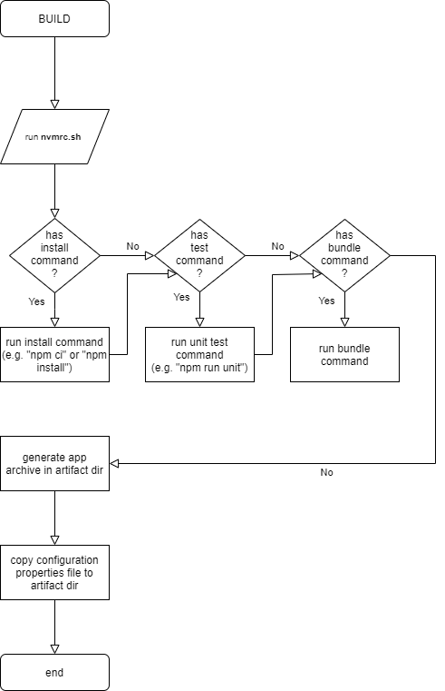
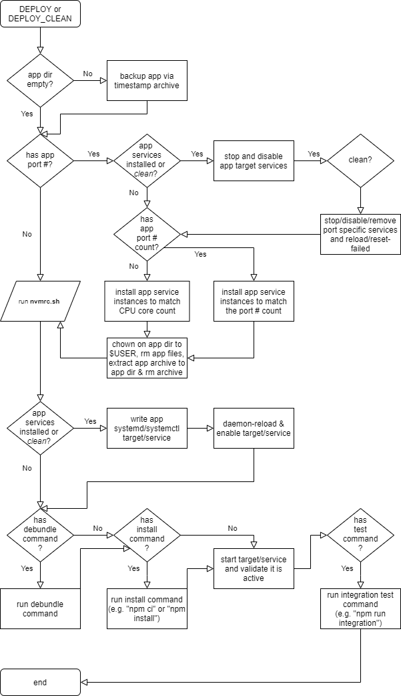

# Node.js Installation
The scripts provided in this directory can be used to agnostically build, install, test and deploy [Node.js](https://nodejs.org) applications using `bash`.

The script utilizes [nvm (Node Version Management)](https://github.com/nvm-sh/nvm) so each application can define it's own `.nvmrc` file that contains the version of Node.js that should be used to build, deploy and run the app.

## Build
The following steps are performed by [`node-app.sh`](node-app.sh):

<kbd></kbd>

## Deployment
The following steps are performed by [`node-app.sh`](node-app.sh):

<kbd></kbd>

## Build/Deploy Script
The [`node-app.sh`](node-app.sh) should be executed using the following paramters:

- __Execution type__ (either `BUILD`, `DEPLOY` or `DEPLOY_CLEAN`)
- __NODE_ENV__ (the Node.js environment that the app will run under)
- __Path to the configuration properties file__

Examples:

```sh
# Build the app using the specified conf file
node-app.sh "BUILD" "development" "/path/to/build.properties"
# Deploy the app using the specified conf file
node-app.sh "DEPLOY" "test" "/path/to/deploy.properties"
# Clean the app and corresponding systemd services
# and redeploy the app using the specified conf file
node-app.sh "DEPLOY_CLEAN" "production" "/path/to/deploy.clean.properties"
```

The configuration proerties file contains the following defaults:

```sh
# ----------------------------------------------
# NOTE: during BUILD the generated artifact
# resides at
# ${app.directory}/artifacts/${app.name}.gz.tar
# ----------------------------------------------
# NOTE: during DEPLOY the generated BUILD
# artifact is expected to reside at
# ${temp.directory}/${app.name}/${app.name}.gz.tar
# ----------------------------------------------

################################################
# Application specific properties
# ==============================================
# The app name used as the systemd service, file
# name, etc.
# ----------------------------------------------
# >>> REQUIRED
# ==============================================
app.name=
# ==============================================
# The app description for systemd service, etc.
# ----------------------------------------------
# >>> REQUIRED
# ==============================================
app.description=
# ==============================================
# The app description for systemd service, etc.
# ----------------------------------------------
# >>> DEFAULT: ./
# ==============================================
app.directory=
# ==============================================
# The app port number for systemd service, etc.
# ==============================================
app.port.number=
# ==============================================
# When the ${app.port.number} is defined, the
# count will determine how to vertically scale
# the node app instances/systemd services.
# ----------------------------------------------
# >>> DEFAULT: the number of CPU cores on the
# target deployment machine or blank when a port
# number is not specified
# ----------------------------------------------
# For example, a port number of 9001 and a count
# of 4 would result in 4 services at ports 9001,
# 9002, 9003 and 9004 
# ==============================================
app.port.count=
################################################

################################################
# Comands will be executed directly to shell.
# Order of execution of commands:
# BUILD:
# 1. install
# 2. test (unit testing)
# 3. bundle
# DEPLOY:
# 1. debundle
# 2. install
# 3. traget service start
# 4. test (integration testing)
# ==============================================
# The command that will install the app.
# typically, this will be "npm ci" or "npm 
# install".
# ==============================================
app.command.BUILD.install=npm ci
app.command.DEPLOY.install=npm install
app.command.DEPLOY_CLEAN.install=npm install
# ==============================================
# The command that will run any tests performed
# on the app (if any)
# ==============================================
app.command.BUILD.test=
app.command.DEPLOY.test=
app.command.DEPLOY_CLEAN.test=
# ==============================================
# The command that will perform any bundling
# required by the app during a build (if any)
# ==============================================
app.command.BUILD.bundle=
# ==============================================
# The command that will perform any debundling
# required by the app during deployment (if any)
# ==============================================
app.command.DEPLOY.debundle=
app.command.DEPLOY_CLEAN.debundle=
################################################

# ==============================================
# The directory to where the nvmrc.sh is located
# Used to install Node.js based upon the .nvmrc
# file located in the root of the app directory
# ----------------------------------------------
# >>> DEFAULT: the same path of the calling
# shell script
# ==============================================
nvmrc.script.directory=

# ==============================================
# The directory to where temporary files will be
# stored
# ----------------------------------------------
# >>> REQUIRED
# ==============================================
temp.directory=/tmp
```
